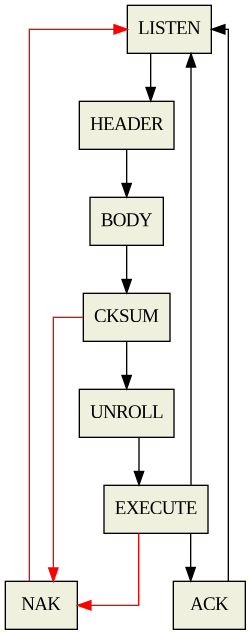

# Smart House (SO Project) - Nicola Colao

## How to use

### Building

The project uses GNU Make as the build system.

To compile the AVR `.elf` executable, just run `make`.  
To generate and flash the `.hex` and `.eep` images, run `make flash`.

To compile the client executable, run `make client`.  
The client executable can also be compiled with debug options enables (verbose
output, debug symbols etc...) with `make client-debug`.

### Executing

The client executable, once built, can be found under
`client/target/smarthouse`.

## Communication
The communication is implemented with a binary comunication protocol.
The handler uses a state automaton, which behaves as follows:

### Operations

The following operations can be performed:

Operation | C enum value
---|:-:
Turn a pin off | `COM_OP_ON`
Turn a pin on | `COM_OP_OFF`
Get the current value for a pin | `COM_OP_GET_VAL`
Set the current value for a pin | `COM_OP_SET_VAL`
Get the pin name | `COM_OP_GET_NAME`
Set the pin name | `COM_OP_SET_NAME`
Save the current status in the board's EEPROM | `COM_OP_SAVE_STATUS`

### Protocol

The smart house controller uses a binary communication protocol on top of the
serial port. Each packet is organized in the following fashion:

Field | Length (bytes) | Description
--- | :-: | ---
Port selector | 1 | Selected pin (PWM/Input/Analog)
Command type | 1 | Selected operation to perform
Length | 2 | Total packet length in bytes
Body | Variable | Packet body (max 32 bytes)
Checksum | 1 | 8-bit XOR integrity checksum

## Further specifications

### Software pin mapping

Software | Physical
:-:|:-:
PWM0 | PIN2
PWM1 | PIN3
PWM2 | PIN5
PWM3 | PIN6
PWM4 | PIN7
PWM5 | PIN8
PWM6 | PIN11
PWM7 | PIN12
ANALOG0 | A0
ANALOG1 | A1
ANALOG2 | A2
ANALOG3 | A3
ANALOG4 | A4
ANALOG5 | A5
ANALOG6 | A6
ANALOG7 | A7
DIGITIN0 | PIN37
DIGITIN1 | PIN36
DIGITIN2 | PIN35
DIGITIN3 | PIN34
DIGITIN4 | PIN33
DIGITIN5 | PIN32
DIGITIN6 | PIN31
DIGITIN7 | PIN30

---
